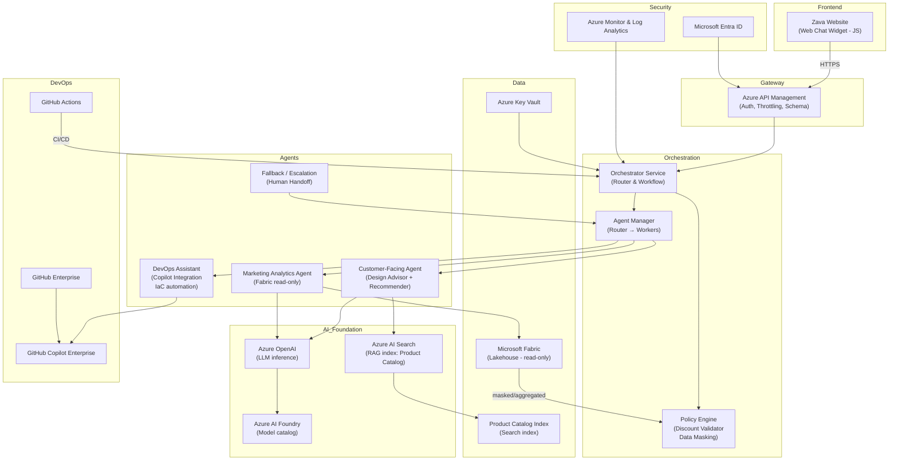

# Zava AI Agent Architecture

```mermaid
flowchart TB
  %% Frontend
  subgraph Frontend
    A["Zava Website<br/>(Web Chat Widget - JS)"]
  end

  %% Gateway
  subgraph Gateway
    B["Azure API Management<br/>(Auth, Throttling, Schema)"]
  end

  %% Orchestration
  subgraph Orchestration
    O1["Orchestrator Service<br/>(Router & Workflow)"]
    O2["Agent Manager<br/>(Router → Workers)"]
    O3["Policy Engine<br/>(Discount Validator<br/>Data Masking)"]
  end

  %% Agents
  subgraph Agents
    C1["Customer-Facing Agent<br/>(Design Advisor + Recommender)"]
    C2["Marketing Analytics Agent<br/>(Fabric read-only)"]
    C3["DevOps Assistant<br/>(Copilot Integration<br/>IaC automation)"]
    CF["Fallback / Escalation<br/>(Human Handoff)"]
  end

  %% AI Foundation
  subgraph AI_Foundation
    D1["Azure AI Foundry<br/>(Model catalog)"]
    D2["Azure OpenAI<br/>(LLM inference)"]
    D3["Azure AI Search<br/>(RAG index: Product Catalog)"]
  end

  %% Data
  subgraph Data
    E1["Microsoft Fabric<br/>(Lakehouse - read-only)"]
    E2["Product Catalog Index<br/>(Search index)"]
    KV["Azure Key Vault"]
  end

  %% DevOps & Security
  subgraph DevOps
    G1["GitHub Enterprise"]
    G2["GitHub Copilot Enterprise"]
    G3["GitHub Actions"]
  end

  subgraph Security
    S1["Microsoft Entra ID"]
    S2["Azure Monitor & Log Analytics"]
  end

  %% Links
  A -->|HTTPS| B
  B --> O1
  O1 --> O2
  O1 --> O3
  O2 --> C1
  O2 --> C2
  O2 --> C3
  C1 --> D2
  C1 --> D3
  C2 --> E1
  C2 --> D2
  C3 --> G2
  D2 --> D1
  D3 --> E2
  E1 -->|masked/aggregated| O3
  KV --> O1
  S1 --> B
  S2 --> O1
  G3 -->|CI/CD| O1
  G1 --> G2
  CF --> O2
```